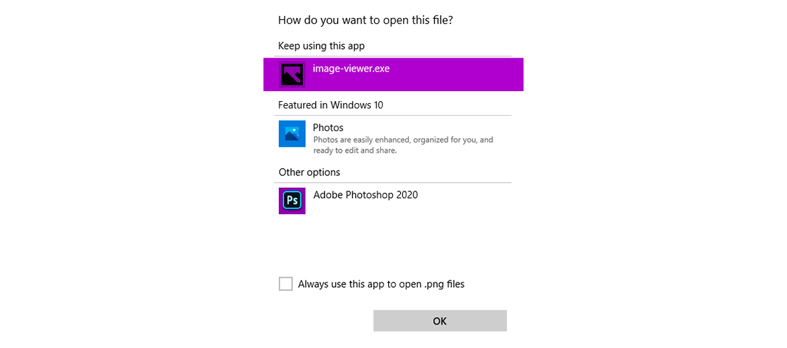
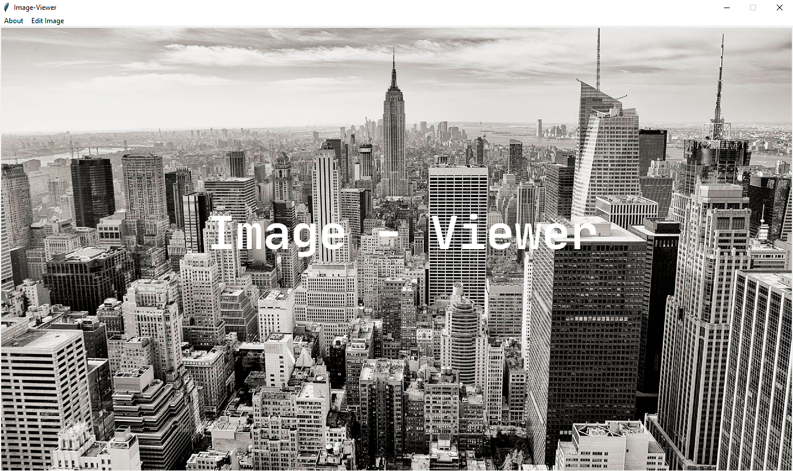

# Image-Viewer

Hi! **Image-Viewer** is a Windows image viewer based on Python 3.

## Using

You must download `Image-Viewer.exe` from the root of the repository. Then you have to open the image with "Image-Viewer.exe".

Then you will see a window like this:

## Using from the console

You must write in the console:

> python main.py `<path to image>`
  
You must replace the `<path to image>`, which is written in the line above, with the path of the image you want to open.

## Modules Used

1. pillow
2. loguru

Python 3.8 or higher is recommended for using this program. You need to install the pillow module. You can do this with the following command:

> pip install -r requirements.txt

**Pillow** is the friendly PIL fork by Alex Clark and Contributors. **PIL** is the Python Imaging Library by Fredrik Lundh and Contributors.
**Loguru** is a library which aims to bring enjoyable logging in Python.

## Compilation

Image-Viewer is compiled with pyinstaller. This command is used for this.

> pyinstaller -F -i icon.ico -w -n Image-Viewer main.py

You can see what these parameters mean in the [pyinstaller documentation](https://pyinstaller.readthedocs.io/en/stable/usage.html#options).

## Versioning

**Image-Viewer** uses [Semantic Versioning](https://semver.org/). See tags for versions.

## License

This project is licensed under the MIT License, see the [LICENSE](LICENSE) file for details.
